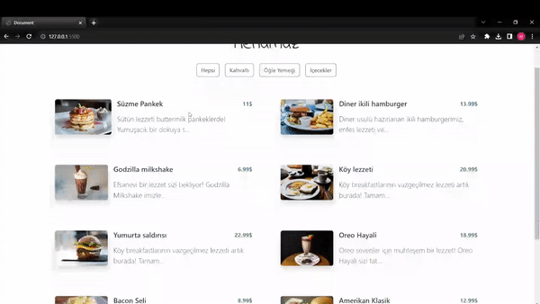

<h1>QR CODE MENU</h1>

This JavaScript-based project allows users to view a cafe menu and provides the ability to display detailed information about each item when clicked. The application presents a list of various products offered by the cafe along with brief descriptions. When users click on any item, a detailed page opens, providing in-depth information such as ingredients, price, and preparation method.

<h2>Features</h2>

<ul>
        <li>Created using Html, css and Javascript</li>
        <li>Full responsive</li>
        <li>Menu data is created in JSON format and integrated into the application, allowing for easy customization and addition of new items.</li>
        <li>Different animations are used</li>
</ul>

<h2>Screen Gif</h2>

